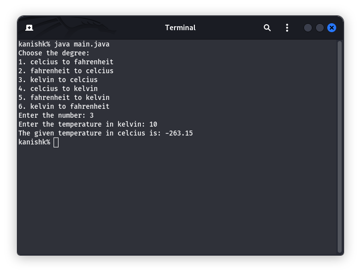

<h1 align="center"><b>Temperature Converter</b></h1>

### Features

- Beginners friendly
- Convert temperature into celcius to fahrenheit.
- Convert temperature into fahrenheit to celcius.

##

### Installation and Use

- First open the terminal or command prompt
- Just, Clone this repository -
  ```
  $ git clone https://github.com/Kanishk-Chaudhary/Temperature-Converter
  ```

- Now go to cloned directory and run `main.java` -
  ```
  $ cd Temperature-Converter
  $ java main.java
  ```

- On first launch, It'll install the dependencies and that's it. ***Temperature-Converter*** is installed.

##

<details>
  <summary><h3>Dependencies</h3></summary>

<b>Temperature-Converter</b> requires following programs to run properly - 
- `git`
- `java`

</details>

<details>
  <summary><h3>Tested on</h3></summary>

- **Ubuntu**
- **Kali**
- **Windows**
</details>

##

<h3 align="center"><i>:: Workflow ::</i></h3>
<p align="center">

</p>
